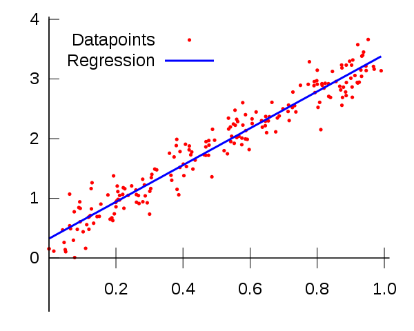

# Linear Regression

## Introduction

Linear regression is one of the most fundamental and widely used predictive modeling techniques in statistics and machine learning. It establishes a relationship between a dependent variable and one or more independent variables by fitting a linear equation to observed data. The key goal of linear regression is to find a linear function (i.e., target function) that predicts the dependent variable values as accurately as possible as a function of the independent variables.

---

## Algorithm

    

Since (1) we are assuming the target function is a linear function of the input features and (2) we know single neuron models are good function approximators, we build a **single neuron model with linear activation function**. We choose the **mean-squred error** as the cost function:
$$
C(\mathbf{w}, b) = \frac{1}{2N}\sum_{i=1}^{N}\Big(\hat{y}^{(i)} - y^{(i)}\Big)^2
$$

The algorithm learns by adjusting weights and bias to minimize the cost function. There are two classic types of algorithms used to update the weights and bias.

**Batch Gradient Descent** works as follows:
1. For each epoch **do**
2. Calculate the full gradient by finding $\frac{\partial C(\mathbf{w}, b; \mathbf{X}, y)}{\partial \mathbf{w}}$ and $\frac{\partial C(\mathbf{w}, b; \mathbf{X}, y)}{\partial b}$
3. Update: $\mathbf{w} \leftarrow \mathbf{w} - \alpha \frac{\partial C(\mathbf{w}, b; \mathbf{X}, y)}{\partial \mathbf{w}}$
4. Update: $b \leftarrow b - \alpha \frac{\partial C(w_1, b; \mathbf{X}, y)}{\partial b}$

**Stochastic Gradient Descent** works as follows:
1. For each epoch **do**
2. For $i = 1, ..., N$ **do**
3. Calculate $\frac{\partial C( \mathbf{w}, b; \mathbf{x}^{(i)}, y^{(i)})}{\partial  \mathbf{w}}$ and $\frac{\partial C( \mathbf{w}, b; \mathbf{x}^{(i)}, y^{(i)})}{\partial b}$.
4. Update: $ \mathbf{w} \leftarrow  \mathbf{w} - \alpha \frac{\partial C( \mathbf{w}, b; \mathbf{x}^{(i)}, y^{(i)})}{\partial  \mathbf{w}}$
5. Update: $b \leftarrow b - \alpha \frac{\partial C( \mathbf{w}, b; \mathbf{x}^{(i)}, y^{(i)})}{\partial b}$

*For single neuron models in practice, stochastic gradient descent should be the preferred way*

---

## Advantages and Disadvantages
Advantages:
- Linear regression models are straightforward to understand and interpret. It can be quickly implemented and run even with large datasets
- With fewer parameters, linear regression is less likely to fit noise in the training data compared to more complex models

Disadvantages:
- The linear assumption doesn't always hold true in real-world data. It cannot directly capture non-linear relationships
- Linear regression is sensitive to outliers, which can disproportionately influence the model parameters