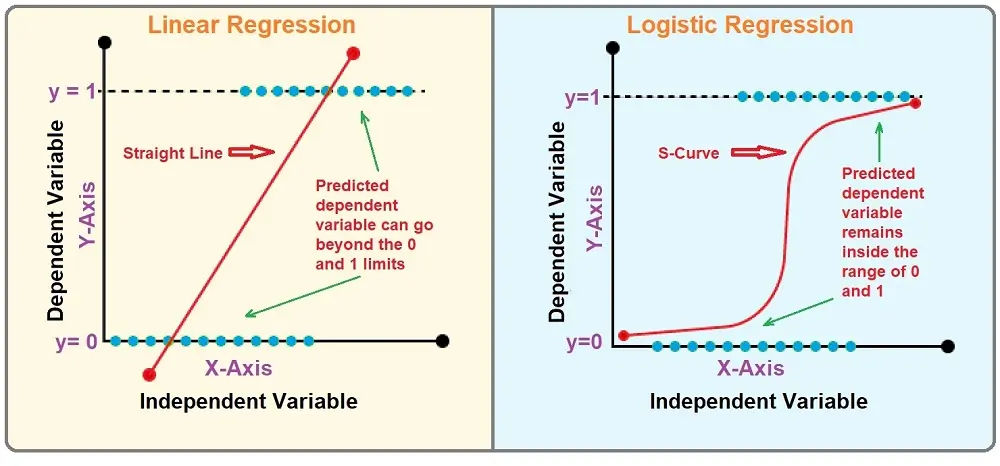

# Logistic Regression

## Introduction

Logistic regression is a statistical model that is commonly used for binary classification tasks in machine learning. It's particularly well-suited for scenarios where one needs to predict the probability of an outcome that can be one of two possible states (e.g., pass/fail, win/lose, alive/dead, true/false). Despite the name "regression", logistic regression is used for classification rather than regression tasks where the dependent variable is categorical.

---

## Algorithm

Here is a comparison between the linear regression and logistic regression.

    

Similar to the linear regression, the logistic regression is also a **single neuron model**. However, the activation function and the cost function are different. 

In logistic regressions, we use the **sigmoid activation function** as the activation function: 
$$
\sigma(z) = \frac{1}{1 + e^{-z}}
$$

In logistic regressions, we use the **Binary Cross Entropy Loss Function** as the cost function to update weights and bias:
$$
L(\mathbf{w}, b) = -\frac{1}{N} \sum_{i=1}^{N} \log P\Big(y^{(i)}\mid x^{(i)}\Big) = \frac{1}{N}\sum_{i=1}^{N}\Big[ -y^{(i)}\log \hat{y}^{(i)} - (1-y^{(i)}) \log (1 - \hat{y}^{(i)})\Big ]
$$

In order to optimize the logistic regression single neuron model, we use **stochastic gradient descent**.

---

## Advantages and Disadvantages
Advantages:
- Logistic regression is straightforward to understand and implement. The coefficients are in terms of odds ratios, which can be easily interpreted as the effect of increasing the predictor by one unit on the odds of the outcome occurring
- Unlike other classification models that only provide the outcomes, logistic regression offers the probabilities of the predicted outcomes, which are crucial in decision-making processes involving risk assessment

Disadvantages:
- Logistic regression assumes a linear relationship between the logit of the outcome and each predictor. This assumption restricts its ability to handle complex relationships in data, which might be better captured by non-linear models
- Logistic regression can be sensitive to problems arising from highly correlated predictors, affecting the performance and stability of the model
- For stable results, logistic regression requires a large sample size. With smaller datasets, the estimates of the regression coefficients can become overly sensitive to changes in the model