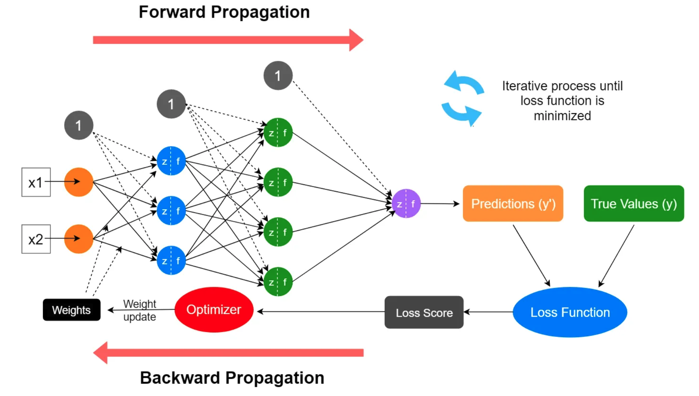

# Neural Networks

## Introduction

Neural networks are a class of machine learning algorithms modeled loosely after the human brain, designed to recognize patterns from complex data. They are particular powerful tools for tasks that involve recognizing patterns, classifying data, and making predictions with high accuracy. Neural networks are central to deep learning, which has seen a tremendous surge in applications across various domains such as image and speech recognition, natural language processing, and autonomous vehicles.

---
## Algorithm

Neural networks work as follows.

    

1. **Architecture**

- **Neurons:** The fundamental unit of a neural network, a neuron, takes a set of inputs, performs a dot product followed by a non-linear operation, and produces an output.

- **Layers:** A typical neural network consists of multiple layers:

    - **Input Layer:** Receives the raw input signal

    - **Hidden Layers:** Intermediate layers that process inputs from the previous layers through weights, biases, and activation functions

    - **Output Layer:** Produces the final output of the network, which is the prediction or classification result.

2. **Weights and Biases**

- These are the parameters of a neural network that are adjusted during te training process. Weights control the strength of the influence one neuron has on another, wihle biases allow the model to fit better with the data by adjusting the output along with the weighted sum of the inputs.

3. **Activation Function**

- This function introduces non-linear properties to the network, which enables the network to learn complex patterns. Common activation functions include the sigmoid, tanh, and ReLU.

4. **Forward Propagation**

- In forward propagation, data moves from the input layer through the hidden layers to the output layer, where each neuron processes the input and passes it on to the next layer.

5. **Bakcpropagation**

- This is the process by which the network adjusts its parameters (weights and biases). Backpropagation involves the computation of the gradient of the loss function (a measure of error) with respect to each weight and bias, which is used to update the 
parameters using an optimization method like graident descent.

6. **Loss Function**

- The loss function evaluates the performance of the neural network by measuring the difference between the actual output and the predicted output by the network. Common loss functions include mean squared error for regression tasks and cross-entropy loss for classification tasks.

---

## Advantages and Disadvantages
Advantages:
- Neural networks are capable of learning and modeling non-linear and complex relationships, which makes them very powerful for handling real-world data
- Neural networks can be adapted to a wide range of tasks beyond just classification or regression, such as generating textual content or creating images
- Neural networks excel at processing data with a large number of features, such as images and complex sequences

Disadvantages:
- Without proper regularization, neural networks tend to overfit, especially when the network has an excessive number of layers and neurons relative to the complexity of the task
- They require significant computational resources and energy for training, particularly as networks become deeper and more complex
- To perform well and generalize effectively, neural networks usually require large amounts of labeled data
- Neural networks do not readily reveal how they arrive at a decision, making them difficult to interpret