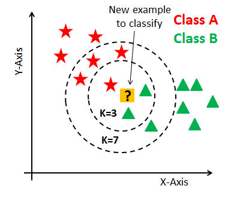

# K-Nearest Neighbors (KNN)

## Introduction

The k-nearest neighbors (KNN) algorithm is a simple, yet powerful, machine learning technique used for both classification and regression tasks. It belongs to the family of instance-based, **non-parametric** algorithms. This means it uses the actual training instances to make predictions rather than deriving a generalized model from the training data. The core idea behind KNN is to predict the label of a new point based on the labels of the "k" nearest points in the feature space. "Nearest" is typically determined by a distance metric such as Euclidean, Manhattan, or Hamming distance.

---

## Algorithm

    

KNN works as follows:
1. **Choose the number "k":** This is the number of closest neighbors to consider.

2. **Calculate distance:** Compute the distance from the new instance to **all** instances in the training dataset.

3. **Identify k nearest instances:** From the calculated distances, identify the k closest instances.

4. **Vote for labels:** For classification, the prediction is made based on the majority vote of the k nearest instances. For regression, it is typically the average of the values of these neighbors.

---

## Advantages and Disadvantages
Advantages:
- KNN is easy to understand and implement. It can effectively achieve high accuracy in many tasks without the need for as much tuning as other machine learning models
- Unlike many other methods, kNN does not make any assumptions about the underlying data distribution
- It can be used for both classification and regression tasks

Disadvantages:
- KNN can be quite slow to predict new instances since it requires calculating the distance and sorting all the training data for each prediction, which can be computationally expensive, especially with large datasets
- Since the entire dataset needs to be stored in memory, KNN can run into challenges as the size of data grows
- KNN performs poorly with high-dimensional data due to the increase in distance computations and the difficulty in calculating distances in many dimensions
