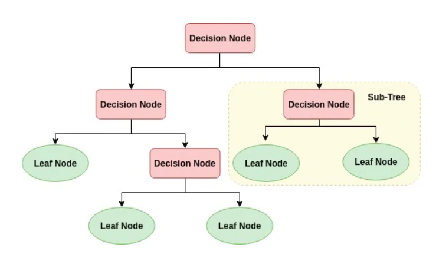

# Decision Trees

## Introduction

Decision Trees are a type of supervised learning algorithm that is predominantly used in classification problems, but can also be extended to regression. This algorithm mimics human level thinking so it is easy to understand and interpret and can be visualized graphically. The goal of using a decision tree is to create a training model that can used decision-like rules inferred from prior data to predict the class or value of the target variable by learning simple decision rules inferred from prior data features.

---

## Algorithm

    

Decision Trees work as follows:
1. **Node Creation**

- **Root Node:** Represents the entire dataset, which further gets divided into two or more homogeneous sets.

- **Splitting:** It is a process of dividing a node into two or more sub-nodes based on certain conditions.

- **Decision Node:** When a sub-node splits into further sub-nodes, it is called a decision node.

- **Leaf/Terminal Node:** Nodes that do not split further, which means the decision tree uses these nodes for making the final prediction.

2. **Construction**

- The decisions or the splitting of nodes are typically based on the most significant attributes and are chosen by calculating attributes' ability to classify data using statistical measures like **entropy**, **gini index**, or **variance reduction**.

    - **Entropy:** A measure of the randomness or uncertainty in the dataset. The goal in a decision tree is to reduce entropy post-split. It is used by ID3, C4.5, and C5.0 tree-generation algorithms.

    - **Gini Index:** A measure of impurity or purity used in the CART (Classificaiton and Regression Tree) algorithm. A gini index of 0 indicates perfect purity, with all elements in the node belonging to a single class.
    
    - **Variance Reducation:** Typically used in decision trees for regression tasks. It measures the reduction in variance after a split.

---

## Advantages and Disadvantages
Advantages:
- Decision trees are simple to understand and interpret, as they can be visualized graphically.
- Decision trees are capable of handling non-linear relationship between parameters effectively.
- Unlike oter algorithms, decision trees do not require feature scalling (like normalization and standardization) before fitting the model.

Disadvantages:
- Decision trees are prone to overfitting, especially with a complex tree with many levels.
- Small variations in the data might result in a completely different tree being generated.