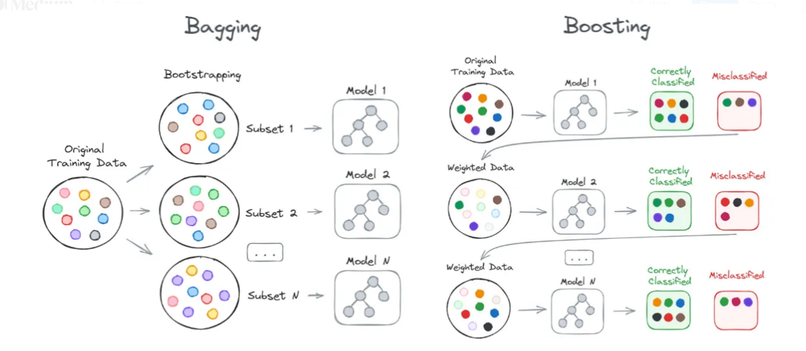

# Ensemble Methods

## Introduction

Ensemble methods in machine learning are techniques that combine multiple models to improve the overall performance, robustness, and accuracy of predictions compared to a single model. These methods are particularly effective in reducing variance, bias, or improving predictions, which often results in better performance than any single contribution model could achieve.

---

## Algorithm

    

Ensemble methods can be broadly categorized into two main types:

1. **Bagging:** This technique involves generating multiple versions of a predictor by training each on a random subset of the training set. For example, the Random Forest algorithm is an extension of this technique that utilizes multiple decision trees. By training each tree on different samples and averaging their predictions, bagging helps in reducing variance and avoiding overfitting.

2. **Boosting:** This approach builds models sequentially by focusing on training instances that previous models misclassified. Boosting attempts to produce new models that performance better by concentrating on errors of earlier models. Examples include AdaBoost and Gradient Boosting.

In this notebook, we will cover **Bagging**, **Random Forest**, **AdaBoost**, and **Gradient Boosting**.

---

## Advantages and Disadvantages
Advantages:
- By combining multiple models, ensembles typically offer better predictive performance than individual models
- Techniques like bagging and random forests can reduce the chance of overfitting
- Ensembles can handle biased data, variance, and noise better than single models

Disadvantages:
- Ensemble methods are generally more complex and computationally expensive than single models
- Models like random forests and boosting are less interpretable than simpler models such as decision trees or linear models
- Choosing the right combination of base models and integration method can be more challenging
