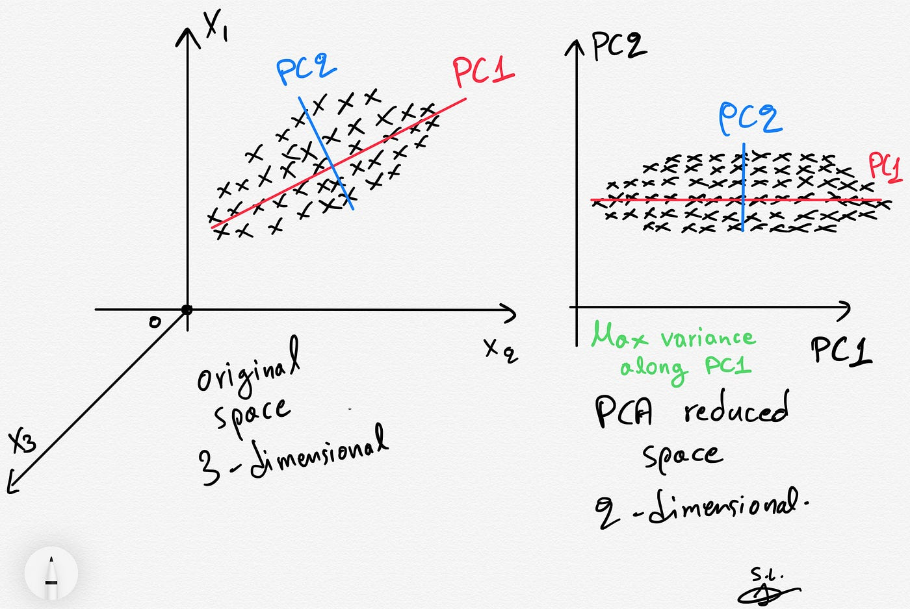

# Principal Component Analysis (PCA)

## Introduction

Principal Component Analysis (PCA) is a statistical technique used for dimensionality reduction while presevering as much variance as possible. It's commonly applied in fields such as machine learning, statistics, and data science to simplify complex datasets, making them easier to explore and visualize.

---

## Algorithm

    

PCA works as follows:

1. **Standarization:** The data is typically standardized to ensure each feature contributes equally, avoiding bias due to the scale of measurements

2. **Covariance Matrix Computation:** PCA computes the covariance matrix of the data to understand how the variables in the dataset are varying from the mean with respect to each other.

3. **Eigenvalue Decomposition:** The covariance matrix is then decomposed into its eigenvectors and eigenvalues. The eigenvectors (principal components) determine the directions of maximum variance, while the eigenvalues determine their magnitude.

4. **Component Selection:** By selecting the top k eigenvectors (based on the largest eigenvalues), PCA reduces the dimensionality of the data. The number of components k is chosen based on the amount of total variance one aims to retain.

The results of PCA is a set of new orthogonal variables, called principal components, that are linear combinations of the original variables. The first principal component has the highest possible variance, and each succeeding component has the highest variance possible under the constraint that it is orthogonal to the preceding components.