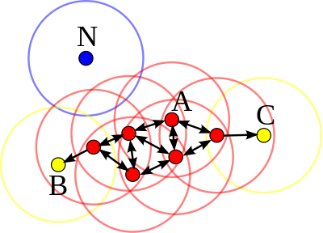

# Density-Based Spatial Clustering of Applications with Noise (DBSCAN)

## Introduction

DBSCAN is a popular clustering algorithm that is used in machine learning to identify clusters in data based on their spatial density. Unlike other clustering methods like K-means, DBSCAN does not require the user to specify the number of clusters beforehand. Instead, it identifies clusters as high-density regions of data points separated by low-density regions.

---

## Algorithm

    

DBSCAN has several key concepts:

1. **Core Points:** A core point is a point that has at least a minimum number of other points (**minPts**) within a given radius ($\epsilon$). These parameters are user-defined and crucial for the behavior of the algorithm.

2. **Border Points:** A border point is not a core point but is in the neighborhood of a core point. Border points are reachable from core points but do not have enough points in their neighborhood to be core points themselves.

3. **Noise Points:** A noise point is any point that is not a core point or a border point. These points are not part of any cluster.

DBSCAN works as follows:

1. **Parameter Selection:** The user selects $\epsilon$ and **minPts**. $\epsilon$ defines the radius of the neighborhood around each point, while **minPts** specifies the minimum number of points required to form a dense region (a cluster).

2. **Classifying Points:** The algorithm proceeds by classifying all points as either core, border, or noise points based on the neigborhood density defined by $\epsilon$ and **minPts**.

3. **Growing Clusters:** Starting from a randomly selected unvisited core point, DBSCAN explores each new point within its neighborhood: if the point is a core point, the search extends to its neighbors, growing the cluster until no more core points are found. This process continues for each unvisited point, leading to the discovery of additional clusters or noise.

4. **Handling Noise:** Points classified as noise are either discarded or treated separately, depending on the application.

## Advantages and Disadvantages

Advantages:
- Does not require specifying the number of clusters
- Can find arbitrarily shaped clusters
- Since it focuses on dense areas, DBSCAN is relatively unaffected by noise and outliers

Disadvantages:
- Choosing inappropriate values for parameters can lead to poor clustering performance, with too many or too few clusters
- DBSCAN can struggle to identify clusters of varying density
- DBSCAN can be computationally intensive, particularly with very large datasets, because it requires calculating and updating neighborhoods for many points